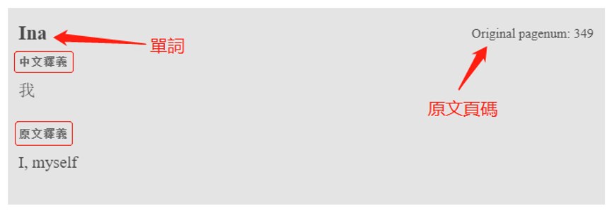
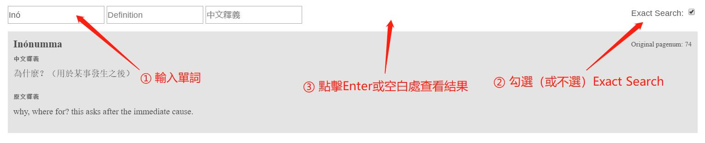
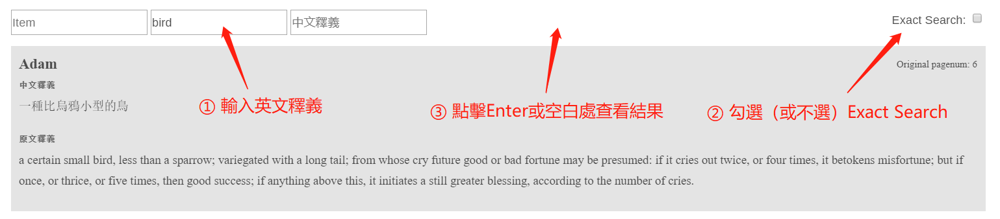
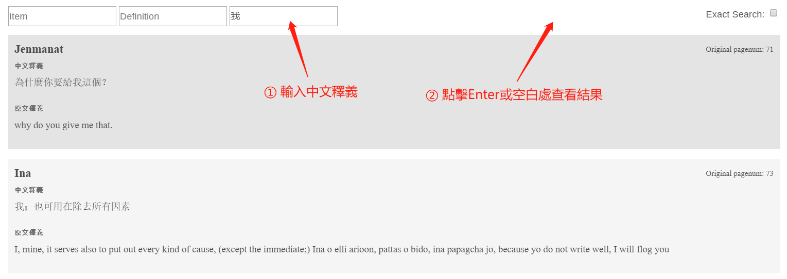

你可以在網頁的導覽列 (navbar) 點擊[**字典**](./dict.html)檢視完整的虎尾壠語字典，或是進入[**電子檢索**](./search.html)搜索字典的內容 (詞條、釋義、中文翻譯等)。下方為線上字典的使用介紹。

### 字典詞條 [🔗](./dict.html)

線上虎尾壠語字典的順序依照虎[尾壠字典英譯本](https://favorlanglang.github.io/dict/Favorlang_eng.pdf)的順序排列。每個詞條的內容包括「單詞」、「中文釋義」、「原文釋義」、「原文頁碼*」四個部分。

下方範例為 **`Ina`** 這個詞條：

* 原文頁碼是指[虎尾壠語字典英譯本](https://favorlanglang.github.io/dict/Favorlang_eng.pdf)的 **PDF 頁數** (非印刷於書上之頁碼)

### 電子檢索 [🔗](./search.html)

進入[**電子檢索**](./search.html)後，共有 3 種檢索方式 (依搜尋優先順序排列)：*單詞檢索*、*英文釋義檢索*、*中文釋義檢索*。這三種檢索方式有優先順序，亦即，系統每次僅會依照**其中一種**方式進行搜尋：

1. 若*單詞檢索*已輸入文字，則會忽略*英文釋義檢索*、*中文釋義檢索*
1. 若*英文釋義檢索*已輸入文字，則會忽略*中文釋義檢索*
1. 若想使用*中文釋義檢索*，則*單詞檢索*與*英文釋義檢索*皆不可輸入文字

下方詳述此三種檢索功能

#### 單詞檢索

該功能為對字典中單詞的檢索。使用步驟如下：  
① 在 item 框内輸入所需檢索的單詞  
② 勾選 Exact Search 以開啓精確檢索功能（區分大小寫與單詞上標），如不勾選則為模糊匹配  
③ 點擊鍵盤 Enter 鍵，或單擊頁面任意空白位置即可查看檢索結果

#### 英文釋義檢索

該功能為對字典中單詞的英文釋義的檢索。使用步驟如下：

該功能為對字典中單詞的英文釋義的檢索。使用步驟如下：  
① 在 Definition 框内輸入所需檢索的單詞  
② 勾選 Exact Search 以開啓精確檢索功能（區分大小寫與單詞上標），，如不勾選則為模糊匹配  
③ 點擊鍵盤 Enter 鍵，或單擊頁面任意空白位置即可查看檢索結果

#### 中文釋義檢索

該功能為對字典中單詞的中文釋義的檢索。使用步驟如下：  
① 在 中文釋義 框内輸入所需檢索的單詞的中文釋義  
② 點擊鍵盤 Enter 鍵，或單擊頁面任意空白位置即可查看檢索結果

